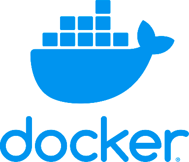

<!-- classes: title -->

# MySQL Umgebung einrichten

<!-- note
Wir verwenden für die Datenbank-Umgebung Docker. Docker ermöglicht uns, im Handumdrehen lokale Datenbank-Server zu starten und wieder zu löschen
-->

---



Docker herunterladen und installieren:

<https://docs.docker.com/docker-for-mac/release-notes/>

---

Git Repository klonen:

```bash
git clone https://github.com/meengit/iad2017db.git
```

---

Umgebung testen (Terminal):

```bash
cd ./mysql
docker-compose up -d
```

---

MySQL Workbench herunterladen: 

<https://www.mysql.com/products/workbench/>

---

Sequel Pro herunterladen:

<https://www.sequelpro.com/>

---

Weitere Clients:

* [Heidi SQL](https://www.heidisql.com/)
* [DataGrip](https://www.jetbrains.com/datagrip/)
* ...

---

## Was ist Docker?

---


Quelle: <https://www.youtube.com/watch?v=TvnZTi_gaNc>

---

## Geschichte von Datenbanken

---

<https://www.youtube.com/watch?v=KG-mqHoXOXY>


