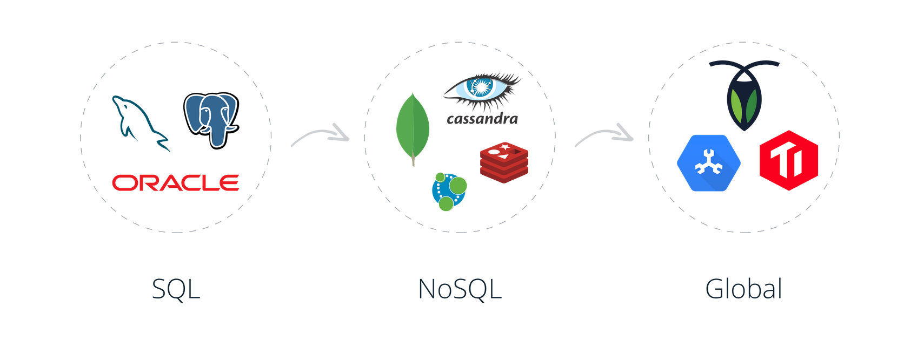
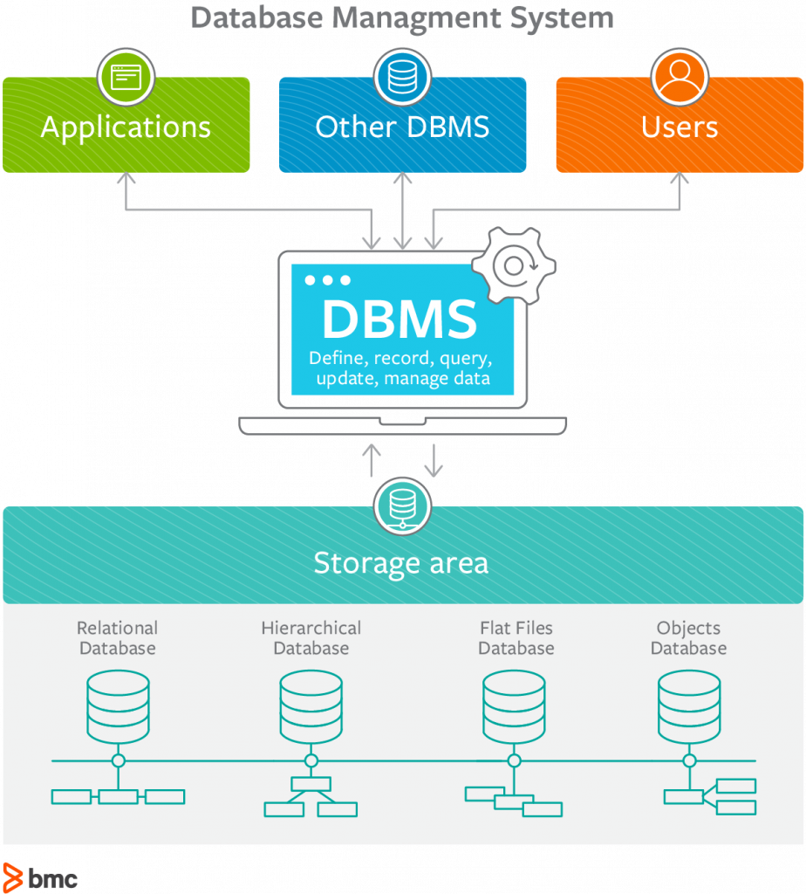

<!-- classes: title -->

## Datenbanktypen

---

## Gruppenarbeit wichtige Datenbanktypen/Unternehmen

* [Exasol](https://www.exasol.com/en/)
* [Google Spanner](https://en.wikipedia.org/wiki/Spanner_(database))
* [IBM DB2](https://www.ibm.com/analytics/db2)
* [MongoDB](https://www.mongodb.com/)
* [MySQL und MariaDB](https://en.wikipedia.org/wiki/MariaDB)
* [Oracle (DB 19c)](https://www.oracle.com/database/technologies/)
* [Postgresql](https://www.postgresql.org/)
* [Redis](https://redis.io/)
* [SQLite](https://www.sqlite.org/index.html?)

---

### Aufgabe

* Geschichte der Datenbank
* Datenbanktyp (SQL, NoSQL, andere)
* Vor- und Nachteile (was wird empfohlen)

*ca. 60 Minuten für Recherche und kurze Präsentation*

---

## Datenbanktypen (zusammengefasst)

* [Relational database](https://en.wikipedia.org/wiki/Relational_database)
  * [SQL](http://www.sqlcourse.com/intro.html)
* [NoSQL](https://cdn.ttgtmedia.com/rms/onlineImages/data_management-nosql.png)
  * [Document-oriented database](https://en.wikipedia.org/wiki/Document-oriented_database)
* [NewSQL](https://en.wikipedia.org/wiki/NewSQL)

---

## Datenbank-Management-System (DBMS)

---

Quelle: <https://www.bmc.com/blogs/dbms-database-management-systems/>

