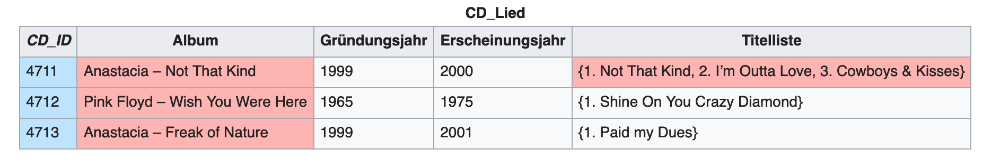
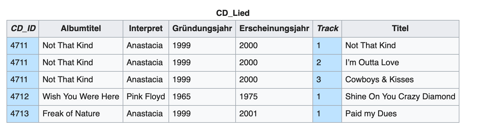
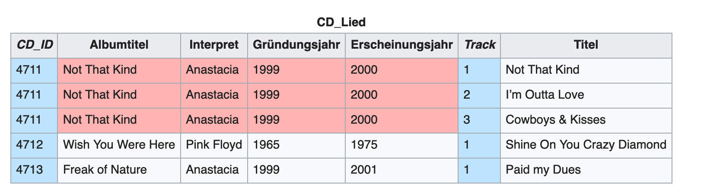
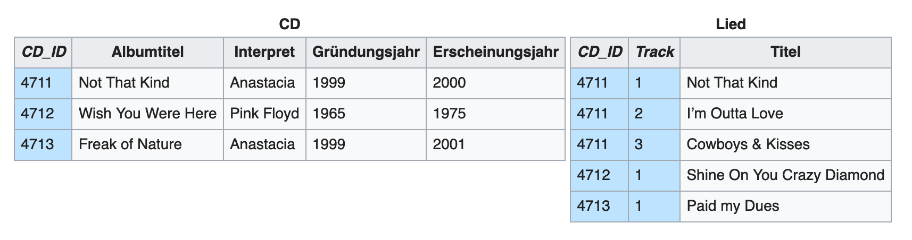
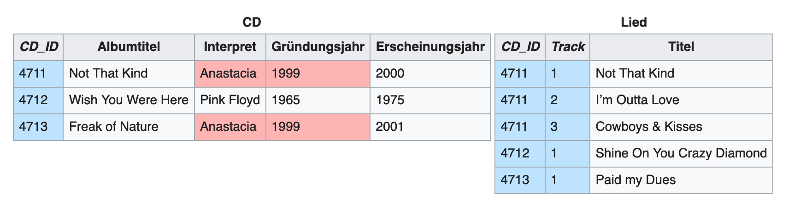
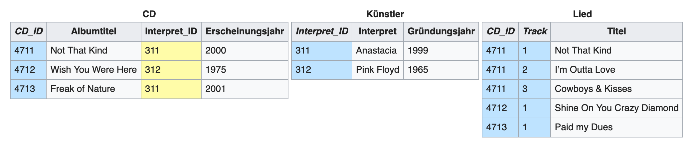

<!-- classes: title -->

## Normalisierung

---

Ziel: Konsistenzerhöhung durch Redundanzvermeidung

---

### Normalisierung Stufe 1

*Jedes Attribut der Relation muss einen atomaren Wertebereich haben, und die Relation muss frei von Wiederholungsgruppen sein.*

---

---

---

### Normalisierung Stufe 2

*Eine Relation ist genau dann in der zweiten Normalform, wenn die erste Normalform vorliegt und kein Nichtprimärattribut (Attribut, das nicht Teil eines Schlüsselkandidaten ist) funktional von einer echten Teilmenge eines Schlüsselkandidaten abhängt. *

---

---

---

### Normalisierung Stufe 3

Die dritte Normalform ist genau dann erreicht, wenn sich das Relationenschema in der 2NF befindet, und kein Nichtschlüsselattribut von einem Schlüsselkandidaten transitiv abhängt.

---

---

---

## Beziehungen

---

### 1:1 – eins zu eins; 

*Jeder Datensatz in Tabelle A ist genau einem Datensatz in Tabelle B zugeordnet.*

---

### 1:n – eins zu viele;

*Der häufigste Beziehungstyp in relationalen Datenbanken; In einer 1:n-Beziehung können einem Datensatz in Tabelle A mehrere passende Datensätze in Tabelle B zugeordnet sein – aber einem Datensatz in Tabelle B ist nie mehr als ein Datensatz in Tabelle A zugeordnet.*

---

### m:n – viele zu viele;

*Jedem Datensatz in Tabelle A können mehrere passende Datensätze in Tabelle B zugeordnet sein und umgekehrt.*

